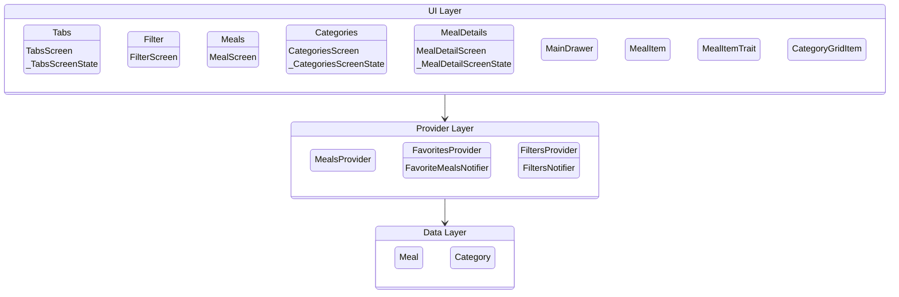

# Meal browser

Flutter project for the second assignment in IDATA2503 Mobile Application 2023.

## Specifications

The list of Specifications is taken from the the current assignment found [here](https://docs.google.com/document/d/1qgQ8u1FsJ0rIL0xSGLjglZMQkozBgNQS5CH81GYk9vc)

I believe the application is meeting every specification as of date 27.10.2023 within the specifications 1-6 + first not numbered point.

The rest of the points given within the assignment will be covered trough this documentation.

### The additional feature

The first not numbered points covers the requirements for an additional feature. It goes as follows:

```"For this App also you are supposed to implement one additional functionality like the previous assignment. The additional functionality should not be simple or obvious."```

In my case I could not come up with any ideas expect for the one I have implemented. It can be argued that this feature is simple and obvious, but without the any other ideas I have to go with this one.

## User Story

Since this application is mostly written using a tutorial given within a Udemy course, I would intemperate it as writing a user story for the feature specified in point 6. My reason being that this is the feature I have planned and implemented, and therefore have sufficient background info about the thinking method to argument for the method of implementation.

### As a person I want to be able to mark and check steps I have done when I am cooking

#### Criteria

- **Given** that I have been presented with a list of steps to make a meal
- **When** I press a check box next to a step
- **Then** It will be visually marked as done

#### Solution

This can be done trough modifying the [meal_details.dart](./lib/screens/meal_details.dart) screen so it has checkmark boxes for every step. This makes it so that the user can check the steps they have done. When the user does so the checkmark will be marked as done and a the step text will get a line trough it to make it more clear for the user.

## File Structure

### [lib](./lib/)

The root folder of the code

- [main.dart](./lib/main.dart) The main application file

#### [data](./lib/data/)

This folder contains the data we are using within the project

- [dummy_data.dart](./lib/data/dummy_data.dart) contains the data we are using for the project

#### [models](./lib/models/)

This folder contains everything that has data models within it such as:

- [meal.dart](./lib/models/meal.dart) that represents a meal
- [category.dart](./lib/models/category.dart) that represents a category

#### [providers](./lib/providers/)

This folder contains everything related to handling data and sending updates aka provider classes

- [favorites_provider.dart](./lib/providers/favorites_provider.dart) that handles the favorites
- [filters_provider.dart](./lib/providers/filters_provider.dart) that handles the filters
- [meals_provider.dart](./lib/providers/meals_provider.dart) that handles the meals

#### [screens](./lib/screens/)

This folder contains everything that is a type of screen within it

- [categories.dart](./lib/screens/categories.dart) that represents the categories screen
- [filters.dart](./lib/screens/filters.dart) that represents the filters screen
- [meal_details.dart](./lib/screens/meal_details.dart) that represents the meal detail screen
- [meals.dart](./lib/screens/meals.dart) that represents the meals screen
- [tabs.dart](./lib/screens/tabs.dart) that represents the different tabs that can be accessed on the screen

#### [widgets](./lib/widgets/)

This folder contains everything that has widget (smaller part of a screen) in it:

- [category_grid_item.dart](./lib/widgets/category_grid_item.dart) that represents a category item
- [main_drawer.dart](./lib/widgets/main_drawer.dart) that represents the main drawer
- [meal_item_trait.dart](./lib/widgets/meal_item_trait.dart) that represents a meal item trait
- [meal_item.dart](./lib/widgets/meal_item.dart) that represents a meal item

## App architecture Diagram



## Class Diagram

Auto generated trough the dcdg package and modified to fit the documentation:

```mermaid
classDiagram
class App
App : +build() Widget
StatelessWidget <|-- App

class Category
Category : +id String
Category : +title String
Category : +color Color

class Meal
Meal : +id String
Meal : +categories List~String~
Meal : +title String
Meal : +imageUrl String
Meal : +ingredients List~String~
Meal : +steps List~String~
Meal : +duration int
Meal : +complexity Complexity
Meal o-- Complexity
Meal : +affordability Affordability
Meal o-- Affordability
Meal : +isGlutenFree bool
Meal : +isLactoseFree bool
Meal : +isVegan bool
Meal : +isVegetarian bool

class Complexity
<<enumeration>> Complexity
Complexity : +index int
Complexity : +values$ List~Complexity~
Complexity : +simple$ Complexity
Complexity : +challenging$ Complexity
Complexity : +hard$ Complexity

class Affordability
<<enumeration>> Affordability
Affordability : +index int
Affordability : +values$ List~Affordability~
Affordability : +affordable$ Affordability
Affordability : +pricey$ Affordability
Affordability : +luxurious$ Affordability


class FavoriteMealsNotifier
FavoriteMealsNotifier : +toggleMealFavoriteStatus() bool
StateNotifier <|-- FavoriteMealsNotifier

class FiltersNotifier
FiltersNotifier : +setFilters() void
FiltersNotifier : +setFilter() void
StateNotifier <|-- FiltersNotifier
Filter <|-- FiltersNotifier

class Filter
<<enumeration>> Filter
Filter : +index int
Filter : +values$ List~Filter~
Filter : +glutenFree$ Filter
Filter : +lactoseFree$ Filter
Filter : +vegetarian$ Filter
Filter : +vegan$ Filter


class CategoriesScreen
CategoriesScreen : +availableMeals List~Meal~
CategoriesScreen : +createState() State<CategoriesScreen>
StatefulWidget <|-- CategoriesScreen

class _CategoriesScreenState
_CategoriesScreenState : -_animationController AnimationController
_CategoriesScreenState o-- AnimationController
_CategoriesScreenState : +initState() void
_CategoriesScreenState : +dispose() void
_CategoriesScreenState : -_selectCategory() void
_CategoriesScreenState : +build() Widget
State <|-- _CategoriesScreenState
SingleTickerProviderStateMixin <|-- _CategoriesScreenState

class FiltersScreen
FiltersScreen : +build() Widget
ConsumerWidget <|-- FiltersScreen

class MealsScreen
MealsScreen : +title String?
MealsScreen : +meals List~Meal~
MealsScreen : +selectMeal() void
MealsScreen : +build() Widget
StatelessWidget <|-- MealsScreen

class MealDetailsScreen
MealDetailsScreen : +meal Meal
MealDetailsScreen o-- Meal
MealDetailsScreen : +createState() ConsumerState<ConsumerStatefulWidget>
ConsumerStatefulWidget <|-- MealDetailsScreen

class _MealDetailsScreenState
_MealDetailsScreenState : -_stepsDone List~bool~
_MealDetailsScreenState : +initState() void
_MealDetailsScreenState : +build() Widget
ConsumerState <|-- _MealDetailsScreenState

class TabsScreen
TabsScreen : +createState() ConsumerState<TabsScreen>
ConsumerStatefulWidget <|-- TabsScreen

class _TabsScreenState
_TabsScreenState : -_selectedPageIndex int
_TabsScreenState : -_selectPage() void
_TabsScreenState : -_setScreen() void
_TabsScreenState : +build() Widget
ConsumerState <|-- _TabsScreenState

class CategoryGridItem
CategoryGridItem : +category Category
CategoryGridItem o-- Category
CategoryGridItem : +onSelectCategory void Function
CategoryGridItem : +build() Widget
StatelessWidget <|-- CategoryGridItem

class MainDrawer
MainDrawer : +onSelectScreen void FunctionString

MainDrawer : +build() Widget
StatelessWidget <|-- MainDrawer

class MealItem
MealItem : +meal Meal
MealItem : Meal
MealItem : +onSelectMeal void FunctionMeal
MealItem : void FunctionMeal
MealItem : +complexityText String
MealItem : +affordabilityText String
MealItem : +build() Widget
StatelessWidget <|-- MealItem

class MealItemTrait
MealItemTrait : +icon IconData

MealItemTrait : +label String
MealItemTrait : +build() Widget
StatelessWidget <|-- MealItemTrait
```



## Group discussion

We decided to work on alone on each of our functionality to make sure we got the most out of the assignment. We did however discuss the assignment and the different solutions we had come up with. We also discussed the different problems we had encountered and how we solved them.

In our discussion we found out that my code could a more optimized by adding each step as a widget. This would allow my the checkboxes and text to updated while not needing to update everything else around it.
